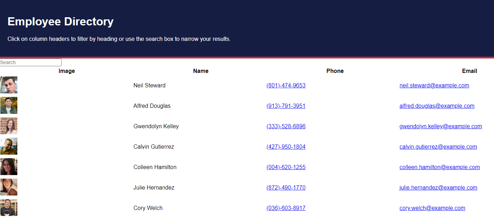

# Employee Tracker
   
  
  Check out the badges hosted by [shields.io](https://shields.io/).
  
  
  ## Description

   
  
  
  My project was to create a react app that allows a user to see their entire employee database.
  ## Table of Contents
  * [Installation](#installation)
  * [License](#license)
  
  ## Installation
  
  *Steps required to install project and how to get the development environment running:*
  
  Clone the repository, the run npm install to install all dependencies, then npm start to start the server.
  
  ## License
  
  MIT License
  
  ---
  
  ## Questions?
  
 